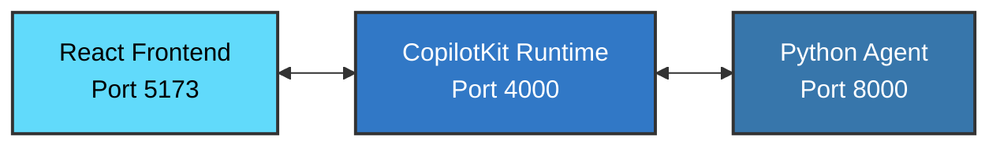

# Demo 5: Basic UI

User interface integration using AG-UI and CopilotKit for a simple chat application. This demo demonstrates how to build a web-based chat interface for your agent.

## What This Demo Shows

This demo showcases:
- Frontend integration with React
- CopilotKit runtime for agent communication
- Real-time chat interface
- Full-stack agentic application architecture

## Running the Demo

This demo requires running three separate components:

### 1. Run the server (agent)
```shell
uv run 05_ag_ui/main.py
```

### 2. Run the CopilotKit runtime service
```shell
cd 05_ag_ui/copilotkit_runtime
npm run dev
```

### 3. Run the UI
```shell
cd 05_ag_ui/ui
npm run dev
```

### 4. Open the webapp
Navigate to: http://localhost:5173

## Key Takeaway

By integrating a web UI, you can create user-friendly interfaces for your agents, making them accessible to end users through familiar chat interfaces.

## Prerequisites

- Python with uv installed
- Node.js installed
- OpenAI API key configured (see main project README)

## Architecture



- **Frontend**: React application with CopilotKit components (Port 5173)
- **Runtime**: CopilotKit runtime service - TypeScript middleware that bridges the frontend and backend (Port 4000)
- **Backend**: Python agent using PydanticAI - handles the AI logic and tool execution (Port 8000)

