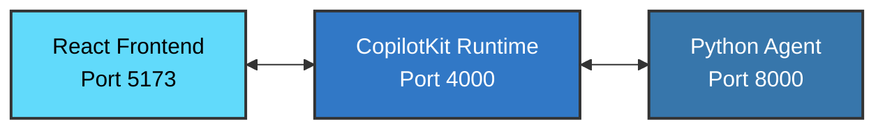

# Demo 6: Generative UI

Generative UI - Dynamic UI components rendered based on agent tool calls. This demo showcases how agents can generate custom UI components dynamically based on their actions.

## What This Demo Shows

This demo showcases:
- Dynamic UI component generation
- Agent-driven interface rendering
- Weather card components as an example
- Seamless integration between agent actions and UI updates

## Running the Demo

This demo requires running three separate components:

### 1. Run the server (agent)
```shell
uv run 06_generative_ui/main.py
```

### 2. Run the CopilotKit runtime service
```shell
cd 06_generative_ui/copilot-runtime
npm run dev
```

### 3. Run the UI
```shell
cd 06_generative_ui/ui
npm run dev
```

### 4. Open the webapp
Navigate to: http://localhost:5173

## Example Usage

When you ask about the weather in a specific location, the agent will render a weather card component with the location information.

**Try asking:**
- "What's the weather in New York?"
- "Show me the weather in Tokyo"
- "How's the weather in London today?"

## Key Takeaway

Generative UI allows agents to create rich, interactive interfaces dynamically based on their actions and the context of the conversation. This creates a more engaging and informative user experience beyond simple text responses.

## Prerequisites

- Python with uv installed
- Node.js installed
- OpenAI API key configured (see main project README)

## Architecture

## Architecture



- **Frontend**: React application with CopilotKit components (Port 5173)
- **Runtime**: CopilotKit runtime service - TypeScript middleware that bridges the frontend and backend (Port 4000)
- **Backend**: Python agent using PydanticAI - handles the AI logic and tool execution (Port 8000)
